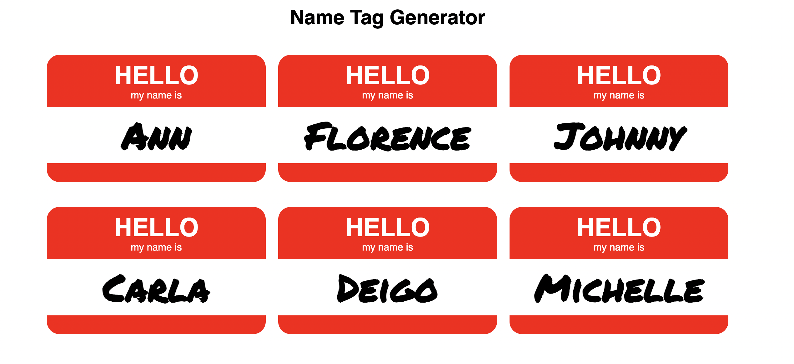

# Name Tag Generator ReactJS
Name tag generator made with React created a data model and mapped over it. It can be updated to display new name tags in separate file data.js 
which has the name array.
 

### Screenshot

### Links

- Live Site URL: [CodeSandbox](https://codesandbox.io/s/l6-5-name-tag-0zl6t)

### Built with

- Semantic HTML5 markup
- CSS 
- JavaScript 
- ES6
- JSX
- [React](https://reactjs.org/) - JS library
